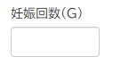
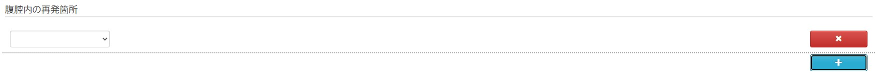
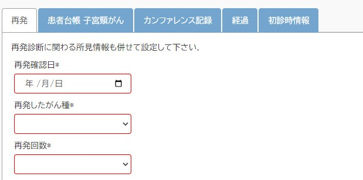
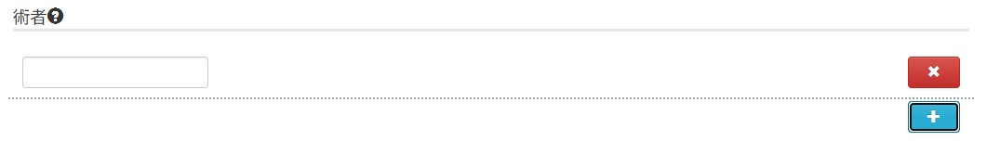

# 概要
UI自動生成（使用ライブラリ：react-jsonschema-form）で作成している入力フォームについて、スキーマ表記と作成されるUIをまとめる。  
スキーマの定義は独自ボキャブラリーを除き[jsonSchema](http://json-schema.org/understanding-json-schema/index.html)に基づいているが、ライブラリ（＋独自の実装）では全てを網羅しているわけではないため、ここ＆ライブラリの[公式ドキュメント](https://react-jsonschema-form.readthedocs.io/en/latest/usage/widgets/)に記載がないものは、基本的に未対応となるので注意。  
※説明に無関係な定義はjsonから省略して記載している場合があるのでご注意ください。基本的に5/27時点のスキーマから抜粋しています。

# 対応一覧
|＃ | 作成されるUI/設定 | 種別 | ボキャブラリー名 | 設定値 | 対応状況 | スキーマ使用     （5/24時点） | 制限事項 | 備考|
|--- | --- | --- | --- | --- | --- | --- | --- | ---|
|1 | テキストボックス：文字列 | 通常 | type | string | 完了（対応なし） | ○ |  | |
|2 | テキストボックス：整数 | 通常 | type | integer | 完了（対応なし） | ○ |  | デフォルトでカウントアップ/ダウン用の上下ボタンが付きますが、不要との指摘を受けたので、cssで無効化|
|3 | テキストボックス：数値（小数含む） | 通常 | type | number | 完了（対応なし） | ○ |  | デフォルトでカウントアップ/ダウン用の上下ボタンが付きますが、不要との指摘を受けたので、cssで無効化|
|4 | テキストボックス：複数type | 通常 | oneOf | [{type:xxx},{type:yyy}] | 完了 | ○ |  | typeを配列で指定|
|5 | テキストボックス：日付入力 | 通常 | format | date | 完了（対応なし） | ○ |  | |
|6 | テキストボックス：文字列（複数行） | 拡張 | jesgo:ui:textarea | boolean | 完了 | ○ |  | |
|7 |  | 拡張 |  | 正の数 | 完了 | ○ |  | |
|8 |  | 拡張 |  | 0(=デフォルト) | 完了 | × |  | |
|9 |  | 拡張 |  | 負の数 | 完了 | × |  | |
|10 | 選択リスト | 通常 | enum | ["aaa","bbb"] | 完了（対応なし） | ○ |  | 選択肢を配列で設定|
|11 | 選択リスト：選択肢≠入力値 | 通常 | anyOf | [{const:0,title:"aaa"},   {const:1,title:"bbb"}] | 完了（対応なし） | ○ |  | [{type:integer,enum:[0],title:"aaa"},   {type:integer,enum:[1],title:"bbb"}]     の書き方も可能。|
|12 | 選択リスト：階層グループ表示 | 通常 | oneOf | [{title:"AAA",     enum:["aaa","bbb"],     }] | 完了 | ○ |  | 入れ子も可能。|
|13 | 選択リスト：入力可能 | 通常 | oneOf | [{type:string,enum:["aaa","bbb"]},     {type:integer}] | 制限事項あり | ○ | 値が入力されていると全ての選択肢が出ない場合がある。     選択肢の表示が他のリストUIと統一されていない。 | |
|14 | 複数アイテムの入力 | 通常 | type | array | 完了（対応なし） | ○ |  | |
|15 | 条件分岐：入力値で他フィールドを変更 | 通常 | if~then~else |  | 制限事項あり | ○ | 対象フィールドが`type:array`の場合は未検証（スキーマ未使用） | `then`,`else`の設定内容は上書きではなくマージされる。|
|16 | 条件分岐：入力値で他フィールドを変更（複数条件） | 通常 | allOf | [{if~then~else},{if~then~else}] | 制限事項あり | ○ | 対象フィールドが`type:array`の場合は未検証（スキーマ未使用） | `then`,`else`の項目は全て揃える必要がある。|
|17 | 条件分岐：入力値で他フィールドの表示を切り替える | 拡張 | jesgo:ui:visiblewhen |  | 制限事項あり | ○ | arrayのitem内で使用された場合のみ対応     （β版のスキーマはすべてarray内で使用） | jsonPointerはIDではなくパスの指定のみ|
|18 | 条件分岐：条件によりフィールド有効化する | 拡張 | jesgo:ui:enabledWhen | - | 未 | ×※ |  | 元は使われていたがif~thenへの書き換えにより未使用|
|19 | オプション：表示タイトル設定 | 通常 | title | "表示したいタイトル" | 完了（対応なし） | ○ |  | |
|20 | オプション：単位表示 | 通常 | units | "表示したい単位" | 完了 | ○ |  | |
|21 | オプション：デフォルト値 | 通常 | default | "デフォルト値" | 完了（対応なし） | ○ |  | |
|22 | オプション：必須項目 | 通常 | required | ["aaa","bbb"] | 完了（対応なし） | ○ |  | 定義されたフィールドは枠線が赤くなり、ラベル横に「*」が表示される|
|23 | オプション：注釈 | 通常 | description | "注釈" | 完了 | ○ |  | ツールチップ表示、改行タグの置き換えは独自実装。|
|24 | オプション：入力不可 | 通常 | readOnly | true | 完了（対応なし） | ○ |  | |
|25 | オプション：各学会への登録用データラベル表示 | 拡張 | jesgo:required | ["JSOG","JSGOE"] | 完了 | ○ |  | |
|26 | オプション：非表示 | 拡張 | jesgo:ui:hidden |  | 完了 | ○ |  | |
|27 | オプション：選択リストのスタイル指定 | 拡張 | jesgo:ui:listtype | list | 未 | × |  | デフォルトのセレクトボックスはこれと同等のスタイル|
|28 |  | 拡張 |  | combo | 未 | × |  | |
|29 |  | 拡張 |  | suggestlist | 未 | ○ |  | |
|30 |  | 拡張 |  | suggestcombo | 未 | × |  | |
|31 |  | 拡張 |  | buttons | 未 | × |  | |
|32 | オプション：サブスキーマタイトルの非表示 | 拡張 | jesgo:ui:hidetitle | - | 未 | × |  | ObjectFieldTemplete   でタイトルなしのテンプレートを作成し、そちらを適用すれば行けそう。     既存のテンプレート"TabItemFieldTemplate"を流用できるかもしれません。|
|33 | オプション：無効化 | 拡張 | jesgo:ui:disabled |  | 未 | × |  | こちらもおそらくif~thenで置き換え可能。|
|34 | オプション：サブスキーマ展開時にインデントしない | 拡張 | jesgo:ui:noindent |  | 未 | × |  | |
|35 | サブスキーマ：タイトルと入力項目を横に展開 | 拡張 | jesgo:ui:subschemastyle | row | 未 | × |  | |
|36 | サブスキーマ：タイトル・入力項目を縦に展開 | 拡張 |  | noindent | 完了 | × |  | デフォルトの表示。スタイルは特にいじっていない。|
|37 | サブスキーマ：横方向に入力項目を展開 | 拡張 |  | inline | 完了 | ○ |  | |
|38 | サブスキーマ：タブ形式で展開 | 拡張 |  | tab | 完了 | ○ |  | ドキュメントの設定プロパティとしてのみ使用可能|
|39 | その他：定義の参照 | 拡張 | jesgo:ref | - | 未 | ○ |  | 参照範囲はおそらくドキュメント内が限度。|
|40 | その他：DBの更新 | 拡張 | jesgo:set | eventdate | 完了 | ○ |  | |
|41 |  | 拡張 |  | death | 制限事項あり | ○ | 確認ダイアログの表示は未対応 | ←対応済みだっけ？森田さんに確認|
|42 |  | 拡張 |  | recurrence | 未 | × |  | |
|43 | その他：DBから値の取得 | 拡張 | jesgo:get | eventdate | 未 | × |  | |
|44 |  | 拡張 |  | age | 未 | × |  | |
|45 |  | 拡張 |  | month | 未 | × |  | |
|46 |  | 拡張 |  | week | 未 | × |  | |
|47 |  | 拡張 |  | day | 未 | × |  | |


<div style="page-break-before:always"></div>

# 入力フォーム自動生成仕様
## 制限事項
- `type`の複数指定は不可。複数Typeが入力可能なテキストボックスを使いたい場合は、oneofで記載する。
- `$comment`,`example`の使用は可だが、入力フォーム作成時に除去する。（ライブラリの仕様上、エラー発生や不要なUIが表示されてしまうため）
- その他、以下のプロパティは使用不可とする。
  - `additionalProperties`：trueを設定すると不要な配列UIが表示されてしまう（ライブラリの仕様）

## その他注意
- arrayは他のtypeとは構造が違う(itemsをはさむ)ので、スキーマ書き換えやformdataを参照する場合は注意。


## 入力フォーム
### テキスト入力

| |
|:-:|

```json
"その他の再発箇所": {
    "type": "string"
},
```

- `type:integer`の場合は整数のみ入力可

| |
|:-:|

```json
"G": {
    "type": "integer",
    "title": "妊娠回数(G)",
},
```

- `type:number`の場合は数値のみ（小数含む）入力可

| |
|:-:|

```json
"身長": {
    "type": "number",
    "units": "cm",
},
```

※`type:number`,`type:integer`はデフォルトでカウントアップ/ダウン用の上下ボタンが付きますが、不要との指摘を受けたので、cssで無効化しています。

### 複数行入力可能

| |
|:-:|

| |
|:-:|

- `jesgo:ui:textarea`にtrue,もしくは表示行数を入れることで設定
- 設定値の絶対値が表示行数。
  - 負の数の場合はスクロール、正の数の場合は指定行数を超えた分だけtextboxの高さを拡張する。
- true,0の場合、デフォルト(3行＋指定行数を超えたら高さ拡張)

```json
"記録": {
    "type": "string",
    "title": "カンファレンス記録.",
    "jesgo:ui:textarea": 5
}
```


### 複数のtypeが入力可能

| |
|:-:|

- `oneOf`の配列でtype毎に定義を記載。使えるtypeは`string`,`integer`,`number`。
- 対象フィールドのtypeを指定すると、複数タイプの入力ができなくなってしまうので注意。
- typeに関わらずなんでも入力可だが、validationでtypeをチェックしている
    - 例：typeがintegerとnumberの場合、数値以外はvalidationでエラーになる

```json
"手術時間": {
    // この階層でtypeは指定しない
    "oneOf": [
        {
            "type": "integer",
            "units": "分",
            "minimum": 0
        },
        {
            "type": "string",
            "pattern": "^([1-9][0-9]?:)?[0-5]?[0-9]$"
        }
    ]
},
```

### 日付入力
- `format`に`date`を設定する。

| |
|:-:|

```json
"手術日": {
    "type": "string",
    "format": "date",
}
```

### 選択リスト
#### 表示と値が一致

| |
|:-:|

- 選択肢を`enum`に記載する。
```json
"所見": {
    "type": "string",
    "enum": [
        "顕微鏡的病変",
        "～2㎝",
        "～4㎝",
        "～6㎝",
        "6㎝をこえる",
        "測定不能"
    ]
},
```

#### 表示と値が異なる

| |
|:-:|

- typeは値の型を指定する。
- `enum`ではなく`anyOf`を使う。

```json
※選択肢のjsonは一部省略
{
    "type": "integer",
    "title": "Performance Status",
    "anyOf": [
        {
            "const": 0,
            "title": "全く問題なく活動できる。<BR/>発病前と同じ日常生活が制限なく行える。"
        },
        {
            "const": 1,
            "title": "肉体的に激しい活動は制限されるが、歩行可能で、軽作業や座っての作業は行うことができる。"
        }
    ]
}
```

以下の書き方もできる。
おそらく上記の形式にも書き換え可能。(※未検証)

```json
"Grade": {
    "type": "string",
    "anyOf": [
        {
            "type": "string",
            "enum": ["1"],
            "title": "Grade 1: 正常な術後経過からの逸脱"
        },
        {
            "type": "string",
            "enum": ["2"],
            "title": "Grade 2: 中等症 輸血および中心静脈栄養を要する場合を含む"
        },
        {
            "type": "string",
            "enum": ["3a"],
            "title": "Grade 3a: 全身麻酔を要さない治療介入を要する"
        }
    ]
},
```

#### 階層グループ表示
| |


| |
|:-:|

- `oneOf`で配列の入れ子にして記載する。
- `title`はグループ名。選択不可。
- グループにぶら下がる値が複数の場合は`enum`、一つの場合は`const`で記載する。

```json
※選択肢、およびグループのjsonは一部省略
"術式": {
    "type": "string",
    "oneOf": [
        {
            "title": "開腹手術",
            "oneOf": [
                {
                    "title": "子宮摘出・子宮頸部摘出術式",
                    "enum": [
                        "腟上部切断術",
                        "単純子宮全摘出術(筋膜内)",
                        ・・・(略)・・・
                    ]
                },
                {
                    "title": "卵巣摘出",
                    "enum": [
                        "右側付属器摘出術(嚢腫摘出術含む)",
                        "左側付属器摘出術(嚢腫摘出術含む)",
                        ・・・(略)・・・
                    ]
                },
                ・・・(略)・・・
                {
                    "title": "合併切除",
                    "enum": [
                        "腹膜播種切除",
                        "その他の臓器の切除"
                    ]
                },
                {
                    "const": "その他の開腹手術"
                }
            ]
        }
    ]        
},
```

### 入力可能リスト

| |
|:-:|

- `oneOf`の配列でtype毎に定義を記載。
- `enum`に選択肢を設定。
- 「複数のtypeが入力可能」の書き方で、enumの定義があるとこちらになる
- 「複数のtypeが入力可能」と同様、なんでも入力はできるが、validationでtypeやenumと一致するかチェックしている
    - 例：以下定義の場合、数字以外は「あり」「なし」のみ入力可能

```json
"閉経": {
    "oneOf": [
        {
            "type": "string",
            "enum": [
                "あり",
                "なし"
            ]
        },
        {
            "type": "integer",
            "units": "歳",
            "minimum": 0
        }
    ],
}
```
※制限事項
- 選択肢がサジェストリストになってしまっているため、値が入力されていると全ての選択肢が出ない場合がある。
  - 例：上記の場合、「あ」を入力してリストを出すと「あり」のみになってしまう
- 選択肢の表示が他のリストUIと統一されていない

### 複数アイテムの入力
- ＋ボタン押下でアイテムのひとまとまりを追加。－ボタンで削除。
- 2件以上ある場合は↑・↓ボタンで順序入れ替え可能。

| |
|:-:|

| |
|:-:|

| |
|:-:|

- `type:array`で定義。
- 追加アイテムは`items`内で定義する。

```json
"術者": {
    "type": "array",
    "description": "筆頭に執刀医、以下を助手として入力",
    "items": {
        "type": "object",
        "jesgo:ui:subschemastyle": "inline",
        "properties": {
            "name": {
                "title": "名前",
                "type": "string"
            },
            "property": {
                "title": "資格",
                "type": "string",
                "enum": [
                    "婦人科腫瘍専門医",
                    "産婦人科内視鏡技術認定医",
                    "婦人科腫瘍専門医+産婦人科内視鏡技術認定医",
                    "産婦人科専門医",
                    "その他",
                    "不明"
                ]
            }
        }
    },
},
```

- 追加アイテムが1つの場合は以下の書き方も可。
  - itemsの直下に直接複数追加したいアイテムを定義

| |
|:-:|


```json
"腹腔内の再発箇所": {
    "type": "array",
    "items": {
        "type": "string",
        "enum": [
            "腟断端",
            "骨盤内",
            "骨盤外",
            "肝転移",
            "骨盤内リンパ節",
            "傍大動脈リンパ節"
        ]
    }
},
```

<div style="page-break-before:always"></div>

## 条件分岐
### 同階層のあるフィールドの入力状態によって、他のフィールドの状態を変えたい
#### `type:object`の場合
- `if~then~else`を使用する。
- `if`で条件を、`then`で`if`がtrueだったときに設定したい内容を、`else`はそれ以外の時の設定内容を定義する。
- `then`,`else`の設定内容は上書きではなくマージされる。

| |
|:-:|

| |
|:-:|

- このスキーマの場合、"腫瘍登録対象"で「はい」が設定された場合のみ"腫瘍登録番号"の入力フィールドを表示する。
```json
{
    "type": "object",
    "properties": {
        "腫瘍登録対象": {
            "type": "string",
            "enum": [
                "いいえ",
                "はい"
            ],
        }
    },
    "if": {
        "properties": {
            "腫瘍登録対象": {
                "const": "はい"
            }
        }
    },
    "then": {
        "properties": {
            "腫瘍登録番号": {
                "type": "string",
                "jesgo:required": [
                    "JSOG"
                ],
                "pattern": "^CC20[0-9]{2}-[1-9][0-9]*$"
            }
        }
    }
}

```

- 条件を複数設定したい場合は、`allOf`で`if~then~else`を配列化する。
- `then`,`else`の項目は、書き換えするしないに関わらず全て揃える必要がある。(jsonの構文エラーになるため)
  - 書き換え不要なフィールドは`"フィールド名": {}`で定義する。

| |
|:-:|

| |
|:-:|

```json
{
    "title": "手術合併症",
    "type": "object",
    "properties": {
        "合併症の種別": {
            "type": "string",
            "enum": [
                "出血",
                "術中手術操作",
                ・・・（略）・・・
            ]
        },
        "出血量": {
            "type": "string",
        },
        "発生した合併症": {
            "$comment": "JSGOEではAE.*.Titleにマップ"            
        },
        "発生部位": {
            "$comment": "JSGOEではAE.*.Locationにマップ"
        },
        "遺残したもの": {
            "type": "array",
            "items": {
                "type": "string",
                "enum": [
                    "検体", "器械", "ガーゼなど衛生材料", "針","上記にないもの"
                ]
            }
        },
        "合併症の内容": {
            "type": "array",
            "$comment": "JSGOEではAE.*.Titleにマップ",
            "items": {
                "type": "string",
                "enum": [
                    "出血", "血腫",
                    ・・・（略）・・・
                ]
            }
        },
        "Grade": {
            "type": "string",
            "title": "合併症のGrade",
            "anyOf": [
                {
                    "type": "string","enum": ["1"],"title": "Grade 1: 正常な術後経過からの逸脱"
                },
                ・・・（略）・・・
            ]
        },
        "転帰": {
            "type": "array",
            "title": "合併症の転帰",
            "items": {
                "type": "string",
                "anyOf": [
                    {
                        "type": "string","enum": ["経過観察"],"title": "経過観察"
                    },
                    ・・・（略）・・・
                ]
            }
        },
    },
    "allOf": [
        {
            "if": {
                "properties": {
                    "合併症の種別": {
                        "const": "出血"
                    }            
                }
            },
            "then": {
                "properties": {
                    "出血量": {
                        "type": "string",
                        "$comment": "JSGOEではAE.*.BloodCountにマップ",
                        "pattern": "(不明|([1-9][0-9]+|[5-9])[0-9][0-9])",
                        "jesgo:ref": "../出血量"
                    }
                },
                "発生した合併症": {},
                "発生部位": {},
                "required": [
                    "合併症の種別", "出血量", "Grade", "転帰"
                ]
            }
        },
        {
            "if": {
                "properties": {
                    "合併症の種別": {
                        "const": "術中手術操作"
                    }
                }
            },
            "then": {
                "properties": {
                    "出血量": {},
                    "発生した合併症": {
                        "type": "array",
                        "items": {
                            "type": "string",
                            "enum": [
                                "臓器損傷",
                                "出血"
                            ]
                        },
                        "minItems": 1
                    },
                    "発生部位": {
                        "type": "array",
                        "items": {
                            "type": "string",
                            "enum": [
                                "子宮", "卵管", "卵巣", "腟",
                                "膀胱", "尿管",
                                ・・・（略）・・・
                            ]
                        },
                    },
                },
                "required": [
                    "合併症の種別", "発生した合併症", "発生部位", "Grade", "転帰"
                ]
            }
        }
    ]
}
```
※制限事項
- `if`や`then`で設定するフィールドが`type:array`の場合は未検証。（現在のスキーマにない）
  - 表示のみの切り替えにはなるが、後述の`jesgo:ui:visiblewhen`はarrayで使用可能

#### 入力によって`type:array`のitems内の表示を切り替える

| |
|:-:|

| |
|:-:|

- `jesgo:ui:visiblewhen`を使用する。
- 条件によって表示したいフィールドに`jesgo:ui:visiblewhen`を定義し、その中で条件のプロパティを定義する。
```json
※実際のスキーマは`$defs`を参照しているが、わかりやすくるするためまとめて記述。

"照射内容": {
    "type": "array",
    "items": {
        "type": "object",
        "jesgo:ui:subschemastyle": "inline",
        "properties": {
            "照射開始日": {
                "type": "string",
                "format": "date"
            },
            "照射終了日": {
                "type": "string",
                "format": "date"
            },
            "照射方法": {
                "type": "string",
                "enum": [
                    "全骨盤照射",
                    "全骨盤照射(中央遮蔽あり)",
                    "3DCRT, IMRT, VMRTなど",
                    "組織内照射",
                    "核医学治療"
                ]
            },
            "照射線量": {
                "type": "number",
                "units": "Gy"
            },
            "核種": {
                "type": "string",
                "jesgo:ui:visibleWhen": {
                    "properties": {
                        "照射方法": {
                            "const": "核医学治療"
                        }
                    }
                }
            }
        }
    }
}
```

<div style="page-break-before:always"></div>

## 表示用オプション
### title
- `type:object`や`type:array`の場合、各サブスキーマのタイトル定義に使用。
- フィールド名とは別の名前でラベルを出したい場合も使用する。

| |
|:-:|

```json
"G": {
    "type": "integer",
    "title": "妊娠回数(G)",
},
```

### units
- 設定した値を、入力フィールドの右横に`()`で囲んで表示する。

| |
|:-:|

```json
"身長": {
    "type": "number",
    "units": "cm",
},
```
### default
- ドキュメントを新規作成した時のデフォルト値を設定する。

| |
|:-:|

```json
"P": {
    "type": "integer",
    "title": "分娩回数(P)",
    "default": 0,
},
```
### required
- 必須入力にしたいフィールド名を定義する。
- 定義されたフィールドは枠線が赤くなり、ラベル横に「*」が表示される。

| |
|:-:|

```json
{
    "type": "object",
    "title": "再発",
    "required": [
        "再発確認日", "再発したがん種", "再発回数"
    ],
    "properties": {
        "再発確認日": {
            "type": "string",
            "format": "date",
        },
        "再発したがん種": {
            "type": "string",
            "enum": [
                ・・・（略）・・・
            ]
        },
        "再発回数": {
            "type": "string",
            "enum": [
                ・・・（略）・・・
            ]
        },
        "腹腔内の再発箇所": {
            "type": "array",
            "items": {
                ・・・（略）・・・
            }
        },
        "腹腔外の再発箇所": {
            "type": "array",
            "items": {
                ・・・（略）・・・
            }
        },
        "その他の再発箇所": {
            "type": "string"
        },
        "測定可能病変": {
            "type": "string"
        }
    }
}

```

### jesgo:required
- 画面としては必須ではないが、各学会への登録用データ（JSOG,JSGOE）としては必須のフィールドに定義する。
- 設定した略称がラベルの末尾に表示される。有効な値は「JSOG」「JSGOE」のみ。
  - JSGOEは現スキーマでは未使用

| |
|:-:|

```json
"治療開始年月日": {
    "type": "string",
    "format": "date",
    "jesgo:required": ["JSOG"],
},
```

## description
- フィールドの注釈を定義する。
- 注釈内に`<br>`,`<br/>`がある場合、改行に置き換える。
- 通常のフィールドの場合は？アイコンのツールチップとして表示される。

| |
|:-:|

- ただし、ドキュメントの最上位の`description`のみ、ツールチップ化せずそのまま表示する。

| |
|:-:|


```json
{
    "type": "object",
    "title": "再発",
    "description": "再発診断に関わる所見情報も併せて設定して下さい.",
    "properties": {
        "再発確認日": {
            "type": "string",
            "format": "date",
        },
        "再発したがん種": {
            "type": "string",
            "enum": [
                ・・・（略）・・・
            ]
        },
        "再発回数": {
            "type": "string",
            "enum": [
                ・・・（略）・・・
            ]
        }
    }
}
```

### readOnly
- 入力不可にしたいフィールドに定義する。
- 値を設定したい場合、`default`で定義する。

| |
|:-:|

```json
"がん種": {
    "type": "string",
    "jesgo:required": [
        "JSOG"
    ],
    "default": "子宮頸がん",
    "readOnly": true
},
```

### jesgo:ui:hidden
- 画面表示せず、データとして持っておきたいフィールドに対して定義する。
  - 画面には出ないが、プラグイン機能の帳票では出力される。
- 値を設定したい場合は、`default`で定義。

| |
|:-:|

- 以下スキーマの場合、"状態"で「死亡」に関連する値が選ばれた場合に、"死亡"をtrueにするために使用。
```json
{
    "type": "object",
    "title": "経過",
    "properties": {
        "確認日": {
            "type": "string",
            "format": "date",
        },
        "状態": {
            "type": "string",
            "enum": [
                "生存(非担癌)",
                "生存(担癌)",
                "当該がん腫による死亡",
                "他のがんによる死亡",
                "癌と直接関係のない死亡",
                "死因不明",
                "生死不明"
            ]
        },
        "備考": {
            "type": "string",
            "jesgo:ui:textarea": true
        }
    },
    "if": {
        "properties": {
            "状態": {
                "enum": [
                    "当該がん腫による死亡",
                    "他のがんによる死亡",
                    "癌と直接関係のない死亡",
                    "死因不明"
                ]
            }
        }
    },
    "then": {
        "properties": {
            "死亡": {
                "type": "boolean",
                "default": true,
                "jesgo:ui:hidden": true,
            }
        }
    },
    "else": {
        "properties": {
            "死亡": {
                "type": "boolean",
                "default": false,
                "jesgo:ui:hidden": true,
            }
        }
    }
}

```

### jesgo:ui:subschemastyle
- サブスキーマフィールド(オブジェクト形式のフィールド)の表示設定を指定する。

### noindent
- デフォルト。未指定の場合は全てこの形式となる。
- サブスキーマフィールド内のタイトル・フィールドを全て縦方向に展開する。

| |
|:-:|

### tab
- ドキュメントの設定プロパティとしてのみ設定可能。
- ドキュメントの直下に作成される子ドキュメントをタブ形式で展開する。

| |
|:-:|

```json
{
     "title": "初回治療",
     "jesgo:subschema": [
        "/schema/treatment/operation",
        "/schema/treatment/chemotherapy",
        "/schema/treatment/radiotherapy"
    ],
    "jesgo:ui:subschemastyle": "tab"
}
```
<div style="page-break-before:always"></div>

## その他
### 定義した内容の参照
- `$defs`で定義したものを、`$ref`を使って参照することが可能。同じ定義を複数使う場合に便利。
- `$ref:"#/$defs/[指定したいフィールドのパス]"`で、$defsのフィールドの指定ができます。
- `$defs`はドキュメントのルートにある必要があります。

```json
{
    "type": "array",
    "title": "実施手術",
    "items": {
        "$ref": "#/$defs/procedure"
    },
    "$defs": {
        "procedure": {
            "$id": "#procedure",
            "type": "object",
            "required": [
                "術式"
            ],
            "properties": {
                "術式": {
                    "type": "string",
                    "oneOf": [
                        ・・・（略）・・・
                    ]        
                },
                "自由入力": {
                    "type": "string",
                    "jesgo:ui:visibleWhen": {
                        "properties": {
                            "術式": {
                                "pattern": "^その他の"
                            }
                        }
                    }
                }        
            } 
        }
    }
}

```
※制限事項
- `$id`を使った指定は未対応です。

### $comment
- jsonにコメントを残したい場合に使用します。
- 画面には表示されません。

```json
{
    "type": "object",
    "title": "患者台帳 子宮頸がん",
    "$comment": "患者レコードの最上位に位置する基本情報.",
}
```

<div style="page-break-before:always"></div>

## validationの設定
- validationの条件に一致しない場合、フィールドのラベル、枠線、値を赤で表示します。
- また、ヘッダ部とドキュメント部の間にエラーメッセージを表示します。


## minimum/maximum
- `type:number`,`type:integer`のみ使用できます。
- minimumは最小値、maximumは最大値が設定できます。
- ※maximumはスキーマでは未使用

| |
|:-:|

- エラーメッセージ
  [ 妊娠回数(G) ] 0以上の値を入力してください。

```json
"G": {
    "type": "integer",
    "title": "妊娠回数(G)",
    "default": 0,
    "minimum": 0
},
```

## minItems/maxItems
- `type:array`でのみ使用できます。
- minItemsは最小件数、maxItemsは最大件数が設定できます。
- ※maxItemsはスキーマでは未使用

### minItems
表示件数が最小件数を下回るとエラーとする。

| |
|:-:|

- エラーメッセージ
 [ 術者 ] 1件以上入力してください。

```json
"術者": {
    "type": "array",
    "items": {
        "type": "object",
        "properties": {
            "name": {
                "title": "名前",
                "type": "string"
            },
            "property": {
                "title": "資格",
                "type": "string",
                "enum": [
                    "婦人科腫瘍専門医",
                    "産婦人科内視鏡技術認定医",
                    "婦人科腫瘍専門医+産婦人科内視鏡技術認定医",
                    "産婦人科専門医",
                    "その他",
                    "不明"
                ]
            }
        }
    },
    "minItems": 1
},
```

### maxItems
表示件数が最大件数と同じになった時点で、「＋」ボタンが表示されなくなる。  
(ライブラリの既存の仕様)
そのため、validationエラーはそもそも起こらないが、念のためvalidationは実装済み。

| |
|:-:|

| |
|:-:|


- エラーメッセージ
 [ 術者 ] 2件以下で入力してください。

```json
"術者": {
    "type": "array",
    "items": {
        "type": "string"
    },
    "maxItems": 2
}
```

## pattern
- `type:string`でのみ使用できます。
- 正規表現を使って、入力値を制限できます。

| |
|:-:|

- エラーメッセージ
     [ 腫瘍登録番号 ] ^CC20[0-9]{2}-[1-9][0-9]*$の形式で入力してください。
```json
"腫瘍登録番号": {
    "type": "string",
    "jesgo:required": [
        "JSOG"
    ],
    "pattern": "^CC20[0-9]{2}-[1-9][0-9]*$"
}
```
## const
- 設定値以外はエラーとなります。
- 現在のスキーマでは、複数typeのケースでのみ使用されています。

| |
|:-:|

- エラーメッセージ
     　[ 出血量 ] 数値で入力してください。または、「不明」のみ入力できます。
※「数値で入力してください。」は`type:integer`側のチェックによるもの。

```json
"出血量": {
    "description": "加刀~終刀までの出血量(g)",
    "oneOf": [
        {
            "type": "integer",
            "units": "g",
            "minimum": 0
        },
        {
            "type": "string",
            "const": "不明"
        }
    ]
},
```

## type:integer
- 整数のみ。小数点はエラーとなります。

| |
|:-:|

- エラーメッセージ
  [ 妊娠回数(G) ] 整数で入力してください。


```json
"G": {
    "type": "integer",
    "title": "妊娠回数(G)",
    "default": 0,
    "minimum": 0
},
```


[end]
